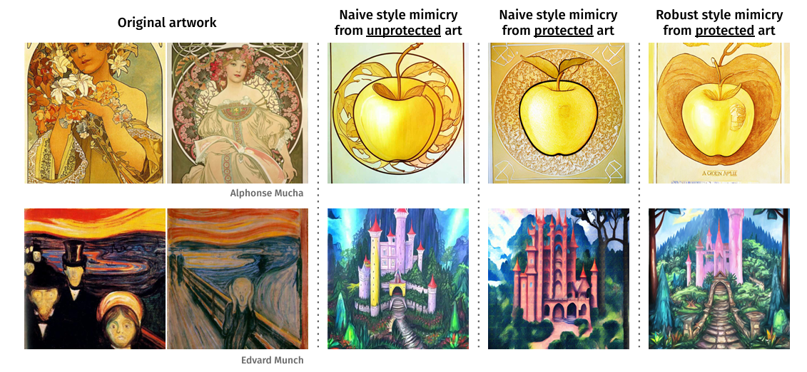

# Style Mimicry Analysis

## Premessa
Il progetto nasce come approfondimento dello studio presentato in [“Robust Style Mimicry”](https://arxiv.org/abs/2406.12027), con l’obiettivo di valutare l’efficacia delle attuali tecniche di protezione delle immagini digitali. In particolare, si mira a dimostrare che le protezioni esistenti non garantiscono una sufficiente separazione nello spazio delle feature latenti tra immagini protette e corrispettive immagini originali, consentendo a un agente malintenzionato di replicare lo stile dell’immagine originale sfruttando le feature apprese dalle immagini nonostante la protezione.

## Metodologia alla base dello studio originale

Nell'articolo originale per generare le immagini è stato impiegato uno script standard di HuggingFace per fare il fine tuning di Stable Diffusion 2.1 su 18 immagini di 10 artisti differenti.

Per proteggere le immagini originali sono state usate 3 protezioni: 
- Mist
- Anti DreamBooth
- Glaze

Tutte le protezioni avevano gli iperparametri settati per massimizzare il livello di protezione.

Una volta generate le immagini da 10 prompt diversi, per valutare l'efficacia dell'imitazione dello stile ci si è affidati a valutazioni umane, in quanto le metriche automatizzate risultano inaffidabili. È stato quindi progettato uno studio utente volto a valutare la qualità dell'immagine e il trasferimento dello stile come attributi indipendenti delle generazioni.

## Analisi dello Spazio delle feature latenti Naive

Il mio progetto punta perciò a provare a livello computazionale ciò che il paper ha provato a livello intuitivo.  

L'ipotesi fondamentale alla base della ricerca è che l'efficacia delle tecniche di protezione avversaria (come Glaze, Mist o Anti-Dreambooth) debba necessariamente riflettersi in una alterazione misurabile della rappresentazione interna delle immagini. In altri termini, se una protezione è efficace, ci si aspetta che, proiettando le immagini in uno spazio latente (embedding space) sufficientemente profondo, le distribuzioni delle immagini protette divergano significativamente da quelle delle immagini originali, impedendo al modello di cogliere le feature stilistiche corrette.

Per verificare questa ipotesi, è stata condotta un'analisi sistematica selezionando cinque architetture di Reti Neurali Convoluzionali (CNN) allo stato dell'arte, pre-addestrate sul dataset ImageNet:
- VGG19, 
- InceptionResNetV2, 
- ResNet50, 
- EfficientNetV2M e 
- ConvNeXtBase. 

Attraverso una pipeline sviluppata in Python, sono stati isolati i vettori di attivazione (feature maps) prodotti da diversi layer — intermedi e finali — di ciascuna rete.  
Data l'elevata dimensionalità di tali vettori, è stata successivamente applicata la tecnica di riduzione della dimensionalità t-SNE (t-Distributed Stochastic Neighbor Embedding), permettendo di visualizzare le relazioni topologiche tra i dati in uno spazio bidimensionale e di analizzare la formazione di cluster tra immagini protette e non protette.

L'analisi sperimentale condotta sui diversi blocchi delle reti ha permesso di isolare il punto ottimale per l'estrazione delle feature. È stato osservato che la massima separabilità spaziale tra gli embedding $E_a$ si ottiene in corrispondenza del layer Dense (o Fully Connected) immediatamente precedente allo strato di classificazione finale.

Tale evidenza è confermata visivamente dal grafico t-SNE riportato di seguito - che confronta le immagini originali di 5 dei 10 artisti dello studio con la loro controparte protetta da mist: 
A sinistra le feature estratte da un livello in mezzo alla rete, a destra quelle estratte dal livello Dense finale.  

Come si può vedere dal plot, in questo stadio della rete l'informazione semantica raggiunge il massimo livello di astrazione. I cluster relativi ai diversi artisti appaiono ben definiti e distanziati, massimizzando la varianza tra le classi necessaria per il riconoscimento stilistico.

Ancora più interessante notare che le immagini con la protezione e le immagini senza la protezione nel plot T-SNE si sovrappongono. Questo è auspicabile ed avviene perchè il sistema di protezione deve poter mantenere le caratteristiche visive generali intatte visto che l'immagine deve sembrare il più possibile quella originale. È quindi corretto che le due rappresentazioni nello spazio delle features latenti calcolate dalle CNN standard siano il più coincidenti possibili.

## Fine Tuning del modello

Per proseguire nello studio è stato quindi eseguito il fine tuning di uno dei modello scelti (ConvNext) atto al riconoscimento specifico dei 5 artisti.  
Come nel paper originale, il set di immagini di addestramento comprendeva 18 immagini da 5 artisti differenti, per un totale di 90 immagini di training.

### Data Augmentation
ConvNext è una CNN molto profonda, quindi con un dataset così piccolo il rischio di overfitting del modello era molto alto. Una parte molto importante del fine tuning è stato quindi il Data Augmentation e la costruzione del modello.

Per prima cosa il dataset è stato partizionato in training e validation set, riservando una quota dello 0.2 (20%) dei campioni per la fase di validazione.  
A questo punto sono stati applicati al training set alcune trasformazioni "style-safe" per aumentare il numero di campioni sul quale addestrare la rete.
l'obiettivo del DA era infatti quello di variare la geometria della scena per generalizzare l'apprendimento, preservando però inalterate le feature stilistiche fondamentali (come la texture deltratto e la coerenza cromatica) che il modello deve apprendere.

Nello specifico, le trasformazioni applicate sono:

- **Horizontal Flip**: Riflessione speculare dell'immagine lungo l'asse
  verticale.
- **Rotation Range**: Rotazione casuale dell'immagine entro un intervallo di
  ±15 gradi.
- **Zoom Range**: Ingrandimento o riduzione casuale dell'immagine fino al 20%.
- **Width & Height Shift**: Traslazione orizzontale e verticale dell'immagine
  fino al 10% della sua dimensione.

Intuitivamente ognuna di queste trasformazioni è sicura visto che non altera l'imamgine o va ad aggiungere rumori che potrebbero "sporcare" lo stile.

### Costruzione del Modello
Una volta risolto il problema dei pochi campioni su cui addestrare il modello è rimasto solo da aggiungere dei layer finali che impareranno effettivamente le caratteristiche stilistiche di ogni artista presente nel dataset di fine-tuning.

Il modello è stato costruito aggiungendo alla coda della CNN i seguenti layer:
1. **GlobalAveragePooling2D**  
   Questo layer riduce la dimensionalità spaziale delle feature map calcolando la media dei valori di attivazione. A differenza del Global Max Pooling, che isola i picchi di massima attivazione (utile per rilevare la presenza univoca di un dettaglio saliente), l'Average Pooling aggrega l'informazione considerando l'intero contesto dell'immagine. Questa proprietà è fondamentale per il riconoscimento dello stile artistico, in quanto lo stile non è definito da un singolo dettaglio locale, bensì da caratteristiche distribuite globalmente su tutta l'immagine.
2. **BatchNormalization**  
   Normalizza l'output del pooling (media 0, varianza 1) per stabilizzare il training e accelerare la convergenza, adattando la scala delle feature provenienti dalla base pre-addestrata.
3. **Dense(124, activation='relu')**  
   MLP da 124 neuroni, Le dimensioni sono contenute così che la rete sia costretta ad apprendere feature generali e non i singoli pixel.
4. Dropout(0.5)  
   Spegnere a caso metà dei neuroni del livelo precedente serve a rafforzare e generalizzare l'apprendimento.
5. **Dense(5, activation="softmax")**  
   Il layer che si occupa della classificazione dei 5 artisti del dataset.

## Strategia di Training
Il processo di training è stato strutturato in due fasi per massimizzare l'adattamento del modello al riconoscimento dello stile. Per entrambe le fasi è stata utilizzata la funzione di perdita *Categorical Crossentropy*.

### Fase di riscaldamento
In questa prima fase, la backbone della rete è stata congelata, addestrando esclusivamente i nuovi layer della testa di classificazione.  
L'obiettivo era stabilizzare i pesi iniziali casuali dei layer densi senza propagare gradienti distruttivi verso la base pre-addestrata.  
- **Configurazione**:  
  L'addestramento è durato 15 epoche con un learning rate di $\eta = 10^{-4}$ ottimizzato tramite Adam.
- **Analisi dei risultati**:  
  Osservando le metriche: la *Validation Accuracy* (che raggiunge il $94.4\%$ all'epoca 15) risulta costantemente superiore alla *Training Accuracy* ($81.9\%$). Questo fenomeno è dovuto alla presenza dei layer di Dropout e Data Augmentation attivi durante il training ma disattivati durante la validazione. La Validation Loss è scesa in modo costante da 1.39 a 0.68, indicando un apprendimento stabile senza segni di overfitting.

### Fase di Fine-Tuning
Una volta stabilizzata la testa, si è proceduto allo scongelamento degli ultimi 30 layer della backbone ConvNeXt, permettendo alla rete di raffinare le feature di alto livello specifiche per il riconoscimento artistico.
- **Configurazione**:  
  Per evitare di stravolgere i pesi pre-esistenti, il learning rate è stato ridotto di due ordini di grandezza ($\eta = 10^{-6}$). È stato inoltre introdotto un criterio di Early Stopping rigoroso (*min_delta=0.05, patience=5*) per arrestare il training non appena i miglioramenti fossero diventati marginali.
- **Analisi dei risultati**:  
  L'addestramento si è interrotto automaticamente alla $6^a$ epoca su $50$ previste. Il modello ha raggiunto la convergenza e la funzione di Early Stopping ha fermato l'addestramento. Il modello ha raggiunto rapidamente una *Validation Accuracy* del $100\%$ e una *Validation Loss* minima di $0.63$. Sebbene il $100\%$ di accuratezza su un validation set ridotto (18 immagini) vada interpretato con cautela, la discesa coerente della loss conferma che il modello ha interiorizzato efficacemente le caratteristiche degli artisti senza degenerare in overfitting.

## DA FARE ANALISI PLOT E PERCHé SONO STATI FATTI
## dioc  

Nel dataset originale erano presenti 3 tipi principali di immagini generate:
- Naive Mimicry da immagini non protette
- Naive Mimicry da immagini protette
- Robust Mimicry da immagini protette

## Risultati dei plot
I plot sviluppati fin ora comprendono tutti e 5 gli artisti.

### Originali vs Naive Mimicry unprotected

### Originali vs Naive Mimicry unprotected vs Naive Mimicry Protected
#### glaze

#### antidb

#### mist

### Naive Mimicry unprotected vs Robust Mimicry
#### glaze

#### antidb

#### mist

### Naive Mimicry unprotected vs Naive Mimcry protected

Da questi plot è molto interessante vedere che i Mucha originali sono sempre molto distanti da ogni altra immagine, probabilmente la CNN riconosce molto bene lo stile di Mucha.  

- Le immagini originali sono più o meno sempre raccolte in cluster accurati e definiti
- Le immagini generate con Naive Mimicry da arte NON protetta e quelle generate con il Robust Mimicry sono molto simili tra di loro, quasi sovrapposte, a dimostrazione che il metodo rompe la protezione